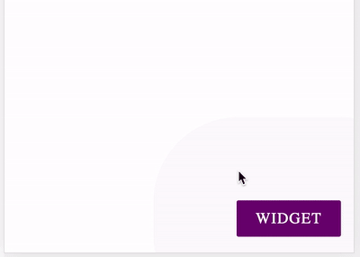

# Javascript embed widget

## Getting Started

You have to just copy paste this script end of the body tag of your main index file (`index.html` or `index.php`)



#### To enable just after page load

```javascript
(function (w, d, s, f, js, fjs) {
  (js = d.createElement(s)), (fjs = d.getElementsByTagName(s)[0]);
  js.src = f;
  js.async = 1;
  fjs.parentNode.insertBefore(js, fjs);
})(window, document, 'script', './widget.js');
```

minified version

```javascript
// prettier-ignore
(function(a,b,c,d,e,f){e=b.createElement(c),f=b.getElementsByTagName(c)[0],e.src=d,e.async=1,f.parentNode.insertBefore(e,f)})(window,document,"script","./widget.js");
```

## Development

These instructions will get you a copy of the project up and running on your local machine for development and testing purposes. See deployment for notes on how to deploy the project on a live system.

### Prerequisites

```
node v12 or higher
```

### Installing

- Clone project https://github.com/antonlashan/js-embed-widget.git
- Install dependencies `yarn install`
- Add/edit environment variables (`src/environment/env.dev.js`)
  > **_NOTE:_** Default environment is `dev`
- And run the app `yarn start`

## Build

You can easily build with environments

```
yarn build
or yarn build:testing
or yarn build:prod
```

## Deployment

Comming soon

---

**NOTE**

**Steps to run docker locally**

- Install [docker](https://docs.docker.com/get-docker)
- Build image with environment specific
  `docker build --build-arg appEnv=prod -t error_report_fe .`

if `appEnv` doesn't specify then default env will be the `testing`

- Run the docker `docker run -p 80:80 error_report_fe`

---
